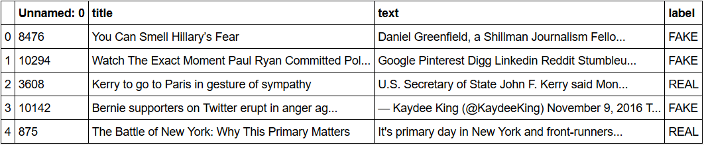
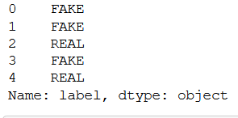
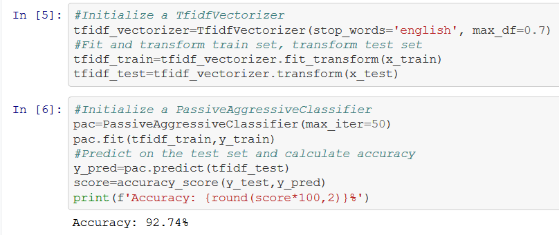

# Detecting-Fake-News-with-Python

**Author**: SHAILESH DHAMA

**Fake News:**

A type of yellow journalism, fake news encapsulates pieces of news that may be hoaxes and is generally spread through social media and other online media. This is often done to further or impose certain ideas and is often achieved with political agendas. 
Such news items may contain false and/or exaggerated claims, and may end up being viralized by algorithms, and users may end up in a filter bubble.

**TfidfVectorizer:**

TF (Term Frequency): The number of times a word appears in a document is its Term Frequency. A higher value means a term appears more often than others, and so, the document is a good match when the term is part of the search terms.

**IDF (Inverse Document Frequency):**

Words that occur many times a document, but also occur many times in many others, may be irrelevant. IDF is a measure of how significant a term is in the entire corpus.

The TfidfVectorizer converts a collection of raw documents into a matrix of TF-IDF features.

**PassiveAggressiveClassifier:-**

Passive Aggressive algorithms are online learning algorithms. Such an algorithm remains passive for a correct classification outcome, and turns aggressive in the event of a miscalculation, updating and adjusting. 
Unlike most other algorithms, it does not converge. Its purpose is to make updates that correct the loss, causing very little change in the norm of the weight vector.

### Business problem:

To build a model to accurately classify a piece of news as REAL or FAKE.

--This advanced python project of detecting fake news deals with fake and real news. Using sklearn, we build a TfidfVectorizer on our dataset. 
--Then, we initialize a PassiveAggressive Classifier and fit the model. In the end, the accuracy score and the confusion matrix tell us how well our model fares.

### DATASET:-

The dataset we’ll use for this python project- we’ll call it FAKE_NEWS DATASET.csv. This dataset has a shape of 7796×4. 
The first column identifies the news, the second and third are the title and text, and the fourth column has labels denoting whether the news is REAL or FAKE. 
The dataset takes up 29.2MB of space.

### REQUIRED LIBRARIES :-

    1.Numpy
    2.Pandas
    3.Scikit-learn

## STEPS :

- Data Preprocessing
- Initialize a TfidfVectorizer
- Fit and transform train set, transform test set
- Initialize a PassiveAggressiveClassifier
- Predict on the test set and calculate accuracy

## RESULTS :

#### Data Preprocessing and description

> Data description


> Dataframe description

#### Fake-news prediction modelling


> Prediction modelling

## SUMMARY :-

We took a political dataset, implemented a TfidfVectorizer, initialized a PassiveAggressiveClassifier, and fit our model. We ended up obtaining an accuracy of 92.82% in magnitude.

### For further information
Please review the narrative of our analysis in [our jupyter notebook](./Detecting%20Fake%20News%20with%20Python.ipynb)

For any additional questions, please contact **shaileshshettyd@gmail.com)

##### Repository Structure:

```
├── README.md                               <- The top-level README for reviewers of this project.
├── Detecting Fake News with Python.ipynb   <- narrative documentation of analysis in jupyter notebook
└── images                                  <- both sourced externally and generated from code
```
